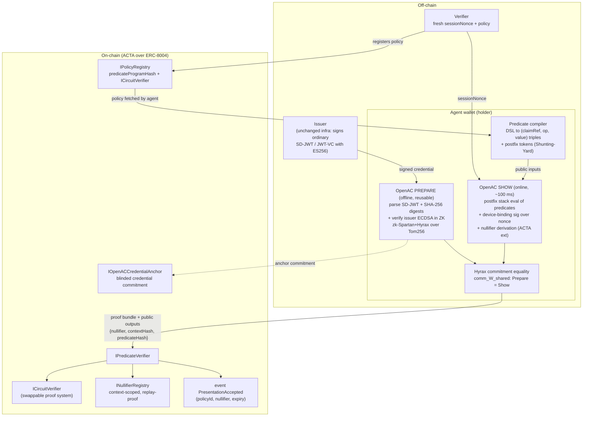

# Proof Machinery for ACTA — PSE zkID Generalized Predicates and OpenAC

**Purpose:** deep research reference on the two pillars ACTA's proof machinery leans on: the **generalized-predicates** work and the **OpenAC** anonymous-credential construction, both from PSE's zkID team (`privacy-ethereum/zkID`). Written for the engineers who will draft the ACTA reference-implementation plan. Companion to `02-acta-proposal.md` (the ACTA post itself).

---

## 0. TL;DR

- **Generalized predicates** (zkID) is a small, deliberately circuit-friendly policy language: private claims, public predicate triples `(claim_index, op, operand)` with `op ∈ {<=, >=, ==}`, composed by a public Boolean **postfix program** (`REF/AND/OR/NOT` tokens) evaluated by a branch-free stack machine inside the circuit. Infix → postfix conversion happens *outside* the circuit via the **Shunting-Yard algorithm**. Ranges, set membership, non-membership, and claim-to-claim comparisons are all derived patterns, not primitives. The 1/OPENAC spec fixes exact operator codes, token codes, claim-normalization rules, and validity constraints — this is directly reusable as ACTA's predicate IR.
- **OpenAC** (IACR ePrint 2026/251) makes ZK presentations over **ordinary, already-deployed issuer signatures** (ES256 SD-JWTs today; RSA in a reference branch; mDoc via Circom circuits) — no BBS+-style issuer migration. It splits proving into a heavy, reusable, re-randomizable **Prepare** proof (SD-JWT parsing + SHA-256 disclosure hashing + issuer ECDSA verification) and a fast per-presentation **Show** proof (predicate evaluation + in-circuit device-binding signature over the verifier's nonce), linked by **equality of Hyrax/Pedersen commitments** to the shared message witness. Backend: **Circom → R1CS → a zero-knowledge-hardened Spartan (sumcheck + Hyrax) over the Tom256 curve** (whose scalar field equals P-256's base field, so P-256 ECDSA verifies natively in-circuit). **No trusted setup.** Measured online cost: **~99–102 ms Show prove (+ reblind) on iPhone 17 / desktop M4, 40.4 kB Show proof, ~9–13 ms verify**; Prepare is ~3 s mobile but amortized offline.
- **What OpenAC v1 deliberately does *not* give ACTA:** nullifiers, revocation, on-chain verification, a `predicateProgramHash`, credential profiles beyond SD-JWT-P256, and predicate parameter sets bigger than toy defaults (`maxPredicates = 2`). These are exactly the pieces the ACTA implementation must add on top — §6 gives the build-vs-reuse split and a composition diagram.
- **Landscape:** BBS+ needs issuer-side crypto changes (disqualifying for ACTA's "issuers keep signing JWTs" story); SD-JWT is the wire format OpenAC already consumes; W3C VC-DM and OID4VCI/EUDI matter for issuance-side interop and are explicitly on zkID's roadmap ("actively scoping W3C VC-JWT, BBS+, EUDI ARF profiles").

---

## 1. Sources, and what was verified vs. not

**Verified directly (fetched and read in full):**

- zkID repo root and directory listings via GitHub UI + GitHub contents API: <https://github.com/privacy-ethereum/zkID> (top level: `generalized-predicates/`, `paper/`, `revocation/`, `specs/`, `wallet-unit-poc/`; ~313 commits, MIT license).
- `generalized-predicates/README.md` (the only file in that directory — it is a **design document, not a code package**): <https://github.com/privacy-ethereum/zkID/tree/main/generalized-predicates>
- The **1/OPENAC specification** (`specs/1-openac/README.md`, status **raw**, Standards Track, editor Nicole Yeh, contributors Vikas Rushi & Vivian Plasencia): <https://github.com/privacy-ethereum/zkID/tree/main/specs/1-openac> — read verbatim; the most implementation-load-bearing source in this document.
- The OpenAC **whitepaper LaTeX sources** in `paper/` (`zkID_construction.tex`, `experiments.tex`, `comparison.tex`, `AC_and_EUDI.tex`, etc.): <https://github.com/privacy-ethereum/zkID/tree/main/paper>. The repo README states: "This directory contains the initial version of the OpenAC whitepaper. The most recent version is available on ePrint."
- `wallet-unit-poc/README.md` and `wallet-unit-poc/openac-sdk/README.md` (SDK API, benchmark tables): <https://github.com/privacy-ethereum/zkID/tree/main/wallet-unit-poc>
- `revocation/` README + `Privacy-Preserving-Credential-Revocation.md`: <https://github.com/privacy-ethereum/zkID/tree/main/revocation>
- OpenAC ePrint **abstract page** (title, authors, abstract, dates): <https://eprint.iacr.org/2026/251>
- The ACTA post (re-fetched for the predicate/nullifier specifics): <https://ethresear.ch/t/anonymous-credentials-for-trustless-agents-acta/24797>

**Not accessible / caveats:**

- The **ePrint PDF** (<https://eprint.iacr.org/2026/251.pdf>) is behind a Cloudflare browser challenge (HTTP 403 to non-browser fetchers). All construction and benchmark detail below therefore comes from the **initial whitepaper version in the repo's `paper/` directory**, not the (possibly revised) ePrint v-latest. The repo LaTeX and the repo READMEs disagree slightly on mobile timings (both reported below); the ePrint version may contain updated numbers and a completed Vega comparison (the LaTeX footnotes say the Vega analysis is deferred to "the next version").
- Secondary confirmation of headline numbers via search: PSE's announcement coverage quotes "proof presentation time of just 0.129 s" — consistent with the repo's iPhone 17 Show prove 99 ms + reblind 30 ms. Attribution note from search results: **Ying Tong** led the scheme design; **Liam Eagen** authored the ZK modifications to Spartan and the proof-reblinding construction. ([zkMesh Feb 2026 recap](https://zkmesh.substack.com/p/zkmesh-february-2026-recap), [IACR news](https://iacr.org/news/item/27692), [Phemex coverage](https://phemex.com/news/article/ethereums-pse-lab-launches-openac-for-anonymous-credentialing-40777))
- `wallet-unit-poc` sub-crate internals (`ecdsa-spartan2`, `circom/`, `mobile/`) were **not** read file-by-file; their READMEs and the top-level benchmark tables were.

**Paper metadata (verified from the abstract page):** *OpenAC: Open Design for Transparent and Lightweight Anonymous Credentials.* Liam Eagen (ideal), Hy Ngo (VNUHCM-University of Science), Vikas Rushi (Ethereum Foundation), Ying Tong (ideal), Moven Tsai (Ethereum Foundation), Janabel Xia (Harvard). ePrint 2026/251, submitted 2026-02-13, category Applications, CC BY.

---

## 2. zkID repo map (what lives where)

| Path | What it is | ACTA relevance |
|---|---|---|
| `generalized-predicates/` | Design doc (README only) for the predicate model | ACTA's predicate IR semantics |
| `specs/1-openac/` | The 1/OPENAC raw spec + `SOURCE-MATRIX.md` | Normative encodings, verifier rules, profile |
| `specs/2-zk-proof-of-personhood/`, `specs/3-zk-age-verification/` | Sibling specs | Personhood-credential use case in ACTA |
| `paper/` | OpenAC whitepaper LaTeX (initial version of ePrint 2026/251) | Construction + security + benchmarks |
| `wallet-unit-poc/` | Reference implementation: `circom/`, `ecdsa-spartan2/` (Spartan2 Rust prover), `mobile/`, `openac-sdk/` (TypeScript + WASM), `openac-studio/`, `web-demo/`, `RSA_REFERENCE.md` | The code ACTA would fork/wrap |
| `revocation/` | Research notes: `Privacy-Preserving-Credential-Revocation.md`, `LeanIMTPlus-Membership-NonMembership-Proofs.md` | Revocation extension for ACTA |

---

## 3. Generalized predicates — the predicate IR

Source: `generalized-predicates/README.md` ("Generalized Predicate Proofs for Verifiable Credentials") + the normative encodings in 1/OPENAC.

### 3.1 The three-part model

A predicate proof takes three inputs:

1. **Claim values** — *private*. The credential's normalized attributes, e.g. `date_of_birth: "1990-03-20"`, `country: "Netherlands"`, `annual_income_eur: 52000`. Formally $C = (c_0, \ldots, c_n)$.
2. **Predicates** — *public*. Primitive comparisons $P_i = (j_i, \mathsf{op}_i, v_i)$: a claim index, an operator from **exactly three** primitives `{<=, >=, ==}`, and an operand that is **either a constant or a reference to another claim index** (enabling claim-to-claim comparisons like `account_balance >= loan_amount`). Each evaluates to a bit $r_i$.
3. **Logical expression** — *public*. A Boolean program over the predicate results using `AND`, `OR`, `NOT`, written in **postfix notation** $L = (\ell_0, \ldots, \ell_t)$. (`OR` is redundant given `AND`+`NOT` but kept as an optimization.)

The prover demonstrates $b = E(L)$ — the postfix evaluation result — without revealing claim values **or intermediate predicate results**. The verifier learns only: the expression structure, the predicate definitions (indices, operators, operands), and the single output bit. This "policy is public, satisfaction-witness is private" split is exactly ACTA's model (the verifier's policy is registered publicly in `IPolicyRegistry`; only the boolean outcome plus nullifier surfaces on-chain).

### 3.2 Postfix + Shunting-Yard: why and how

Confirmed: the README states postfix is used "to avoid parsing and operator precedence handling inside the circuit," and that **infix → postfix conversion uses the Shunting-Yard algorithm, adapted for logical operators, performed outside the circuit**. In-circuit evaluation is a fixed-length stack machine — no branching, no recursion, constant control flow — which is what makes it cheap in R1CS:

```
Expression: (P0 AND P1) OR P2   →  postfix: P0 P1 AND P2 OR
Stack trace: push r0; push r1; AND → pop,pop,push; push r2; OR → pop,pop,push; result = top
```

**Evaluation is two-step** (deliberately, for modularity): step 1 evaluates all predicates into a boolean array; step 2 runs the postfix program over that array. The README discusses (as future work, with stated circuit-cost trade-offs) collapsing to a single-step heterogeneous stack, adding compound operators like `IN`, and adding arithmetic (`income_1 + income_2 >= threshold`). **None of these extensions are implemented** — an ACTA plan should assume the three-primitive two-step model.

### 3.3 Derived patterns (all sugar over the three primitives)

| Pattern | Encoding |
|---|---|
| Range `30000 <= salary <= 60000` | `P0: salary >= 30000`, `P1: salary <= 60000`, program `P0 P1 AND` |
| Membership `country IN {NL, BE, DE}` | one `==` per element, program `P0 P1 OR P2 OR` |
| Non-membership (e.g. ACTA's `operator_jurisdiction_not_in(OFAC_LIST)`) | `==` per element, program `P0 NOT P1 NOT AND …` |
| Claim-to-claim | operand is a claim index: `P0: account_balance >= loan_amount` |
| Age ≥ 18 | verifier computes cutoff `today − 18y` outside the circuit; `P0: date_of_birth <= cutoff` |

Implementation note for ACTA: set non-membership against a list of size *k* costs *k* equality predicates + *k* `NOT`s + (*k*−1) `AND`s in the program — fine for small sanction lists, not for large ones. Large sets should instead use the **Merkle non-membership** machinery from `revocation/` (§4.1), which is a different circuit, not a predicate-program pattern.

### 3.4 Normative encoding (from 1/OPENAC — reuse this verbatim)

The spec fixes the wire/circuit encoding the SDK implements today:

- **Operator codes:** `LE = 0`, `GE = 1`, `EQ = 2`.
- **Predicate record:** `{ claimRef: uint (zero-based index into normalized-claim vector), op, compareValue: scalar }`. Comparisons are **unsigned bounded-integer** comparisons over `valueBits` bits.
- **Logic tokens:** `REF = 0` (push result of predicate *value*), `AND = 1`, `OR = 2`, `NOT = 3`. A program is valid iff every `REF` is in range, every operator has sufficient stack inputs, and evaluation ends with exactly one value on the stack. Malformed programs MUST be rejected.
- **Mandatory rejections:** negative `compareValue`; `compareValue >= 2^valueBits`; active claim value outside `[0, 2^valueBits)`; unsupported `(op, claimFormat)` pairs (e.g. `LE` over a `string` claim).
- **Claim normalization (SD-JWT-P256 profile):** format tags `0=bool, 1=uint, 2=iso_date, 3=roc_date, 4=string`. `iso_date` → integer `YYYYMMDD`; `roc_date` → `YYYMMDD`; `string` → up to 8 ASCII bytes packed big-endian into one scalar; inactive slots normalize to `0`; strict lexical validation with mandatory rejection on failure. Mapping disclosed claim *names* to claim *slots* is verifier-side; there is no normative slot registry.
- **Reference circuit parameters (Show defaults):** `nClaims = 2`, `maxPredicates = 2`, `maxLogicTokens = 8`, `valueBits = 64`. **These are toy-sized.** ACTA policies like "audit_score >= 80 AND jurisdiction not in OFAC_LIST(k)" need a larger parameter set, which per the spec's versioning rules means new circuits, new keys, and a new `version` identifier bound to them.

### 3.5 The developer-facing DSL and the compilation path

`openac-sdk` exposes a JSON predicate DSL that compiles down to the triples + postfix tokens:

```typescript
{ all: [ { claim: "age", op: ">=", value: 18 },
         { any: [ { claim: "kyc_tier", op: "==", value: 2 },
                  { claim: "kyc_tier", op: "==", value: 3 } ] } ] }
// combinators: all / any / not (nest arbitrarily); claim-to-claim via compareTo;
// value types bigint | number | Date | string; formats inferred, overridable
```

So the full pipeline is: **DSL (JSON, nested infix-ish) → [SDK compiler / Shunting-Yard] → predicate array + postfix token array → circuit public inputs**. This compiled form is the natural canonicalization target for hashing (next section).

### 3.6 `predicateProgramHash` — status: **not defined anywhere in zkID; ACTA must define it**

Verified carefully because ACTA's `IPolicyRegistry` depends on it: the ACTA post says the verifier's policy "derives a deterministic `predicateProgramHash`" and that the holder "compiles it" with a generalized-predicates package — but **neither the generalized-predicates README, nor 1/OPENAC, nor the SDK define any predicate-program hash**. The only related public output in OpenAC today is `expression_result` (one bit). The implementation plan must therefore specify:

1. **Canonical serialization** — hash the *compiled* form, not the DSL: `H(version ‖ circuitParams(nClaims, maxPredicates, maxLogicTokens, valueBits) ‖ claimSlotMap ‖ predicates[] as (claimRef, op, compareValue) ‖ logicTokens[] as (type, value))`, with fixed-width big-endian field encoding. Hashing the DSL JSON would be fragile (key order, whitespace, number formats); hashing the compiled arrays inherits the spec's own validity rules.
2. **Binding into the proof** — either (a) make the hash a public input the Show circuit recomputes/constrains (strongest: proof is unusable for any other policy), or (b) have the on-chain verifier recompute the hash from the registered policy and match it against the verifying-key/`version` tuple (cheaper; relies on the spec's rule that any change to circuit params or public-input layout ⇒ new `version`). Option (a) needs a circuit-friendly hash (Poseidon over the field elements) since SHA-256 over the serialization would bloat the Show circuit.

---

## 4. The rest of zkID that ACTA will touch

### 4.1 Revocation research (`revocation/`)

Contents: `README.md`, `Privacy-Preserving-Credential-Revocation.md`, `LeanIMTPlus-Membership-NonMembership-Proofs.md`, plus links to PSE/DIF articles. Findings:

- Framing: "revocation is critical for maintaining trust; without it, verifiers cannot know whether a credential is still valid" — vs. minimizing disclosure.
- Approaches compared: status lists (DIF revocation report), cryptographic accumulators, Sparse Merkle Trees, Indexed Merkle Trees, and **LeanIMT+** — the last identified as the preferred structure for "low circuit complexity and efficient tree operations" in ZK.
- Direction: **commitment-based revocation handles + ZK non-membership proofs** against a LeanIMT+ root, so a successful presentation stays anonymous and unlinkable and the issuer learns nothing at verification time. Root-history handling is an open issue (repo issue #98).
- **No benchmarks, no spec.** 1/OPENAC explicitly lists revocation as out of scope / a future extension point. For ACTA: revocation = one extra non-membership sub-circuit against an on-chain (or anchored) revocation root — architecturally parallel to the sanctions-list case in §3.3.

### 4.2 `wallet-unit-poc` — the reference implementation

- **Formats implemented:** SD-JWT (ES256) via `openac-sdk`; mDoc/mDL (ISO 18013-5) via Circom circuits (`circom/docs/mdoc-spec.md`). RSA-2048/4096 verifier circuits for RS256 JWTs exist on a reference branch (`feat/rsa-verifier-circuit`, see `RSA_REFERENCE.md`). The README has an explicit call for feedback on **W3C VC-JWT, BBS+, EUDI ARF profiles**.
- **Stack:** Circom circuits compiled with **secq256r1 as the native field**, proven with **Spartan2 + Hyrax** (Rust, `ecdsa-spartan2/`), shipped to TypeScript via WASM (`openac-sdk`), with a mobile app (`mobile/`) used for the paper's benchmarks and studio/web-demo tooling.
- **SDK shape (matters for ACTA's holder-side):** `OpenAC.init()` → `loadKeysFromUrl("1k"|"2k"|"4k"|"8k")` (circuit size auto-picked to fit the JWT) → `precompute({jwt, disclosures, issuerPublicKey, keys, predicates})` once per credential → `present({precomputed, verifierNonce, devicePrivateKey, keys, predicates})` per session → `verify(proof, verifyingKeys)` returning `{valid, expressionResult, deviceKey: always null}`. The SDK README flags the load-bearing check in bold terms: verification **byte-compares `comm_W_shared` between the Prepare and Show instances before either SNARK is verified** — "the check that ties the two proofs to the same underlying credential."
- **Memory footprint:** peak proving memory 2.27 GiB (Prepare) / 1.96 GiB (Show) on mobile — relevant if ACTA agents prove inside constrained runtimes rather than phones.

---

## 5. OpenAC — the construction

Sources: whitepaper LaTeX (`zkID_construction.tex`, `comparison.tex`, `experiments.tex`), 1/OPENAC spec, abstract page.

### 5.1 The problem it solves

Classic anonymous credentials (CL/Idemix, BBS+) get unlinkable multi-show by making the **issuer** use special signatures that admit efficient ZK proofs of knowledge. That is exactly what real deployments won't do: national eID and enterprise issuers sign ES256/RS256 JWTs and mDocs with existing PKI and HSMs. OpenAC's bet — shared with Microsoft's **Crescent** (ePrint 2024/2013) and Google's **Longfellow** ("Anonymous Credentials from ECDSA", ePrint 2024/2010) — is to leave issuance untouched and prove, in zero knowledge, "*I hold a credential whose ordinary ECDSA signature verifies under this issuer key, and its hidden claims satisfy the policy*." The whitepaper's positioning against those two (from `comparison.tex`): Crescent achieves the same reuse pattern but on **Groth16 with a large per-circuit trusted setup** (~172 s setup, 710 MB+ pk); Longfellow is transparent (sumcheck + **Ligero**, custom ECDSA/SHA-256 circuits) but has **no reusable offline phase** — full ~680 ms proof per presentation and ECDSA-specific machinery. OpenAC = Crescent's prepare/show reuse + Longfellow's transparency.

### 5.2 Two linked relations: `prepare` and `show`

**Prepare (circuit C₁)** — per-credential, presentation-independent, run offline when the credential enters the wallet. Statement (public input: issuer key $PK_I$; witness: the SD-JWT $S$ and messages $\{m_i\}$):
1. $S$ parses as an SD-JWT into messages $\{m_i\}$, salts $\{s_i\}$, digests $\{h_i\}$, issuer signature $\sigma_I$;
2. $h_i = \text{SHA-256}(m_i, s_i)$ for all $i$ (disclosure-digest consistency);
3. $\text{ECDSA.verify}(\sigma_I, PK_I) = 1$.

**Show (circuit C₂)** — per-presentation, online. Statement (public: predicates $\{f_i\}$ and claimed results $\{p_i\}$; witness: messages $\{m_i\}$):
1. $p_i = f_i(m_1, \ldots, m_n)$ — the generalized-predicate evaluation of §3;
2. $\text{ECDSA.verify}(\sigma_{\text{nonce}}, PK_{\text{device}}) = 1$ — **device binding**: outside the circuit the holder's device key (bound in the credential's `cnf.jwk`) signs the verifier's fresh nonce; the circuit verifies that signature against the key committed among the messages.

**Linking.** Both circuits separate the message vector $\{m_i\}$ into a dedicated witness column and commit to it with a **Hyrax-style Pedersen vector commitment**; the Show proof reuses the *same commitment randomness* $r_1^{(j)}$ chosen during Prepare, and the verifier checks **commitment equality** across the two proofs. This replaces Longfellow's MAC-based linking. Soundness of the whole scheme hinges on this check (the spec: a verifier that validates both proofs but skips linking "is not conformant").

**Unlinkability across presentations** comes from **re-randomization**: `prepareBatch` takes the initial Hyrax commitment and produces a batch of re-randomized commitments $c^{(j)}$ (fresh $r_1^{(j)}$, each a cheap single group operation on the message-column commitment) and finishes the Spartan sumcheck IOP for each, yielding a stock of unlinkable, presentation-ready Prepare proofs. Each presentation consumes one $(π_{\text{prepare}}^{(j)}, r_1^{(j)})$ pair.

**Curve trick.** Both relations run over **Tom256 (T256), whose scalar field equals P-256's base field**, so P-256 ECDSA verification is native arithmetic in-circuit, and both proofs' commitments live in one group (making the equality check well-defined). Prepare still contains wrong-field work (SHA-256 bit operations), but that cost is amortized into the offline phase — the split is "by phase, not by field arithmetic."

### 5.3 Proof system: zk-Spartan + Hyrax, fully transparent

Frontend: **Circom → R1CS**. Backend: **Spartan** (sumcheck-based R1CS SNARK) with **Hyrax** Pedersen polynomial commitments ($\sqrt{n} \times \sqrt{n}$ matrix commitment of the witness MLE). Spartan+Hyrax is not zero-knowledge out of the box; the paper adds ZK in two moves (Eagen's contribution):

1. **Witness/matrix blinding:** append four random values $(s_0..s_3)$ to the witness vector and three constraints ($s_0 \cdot 0 = 0$, $0 \cdot s_1 = 0$, $s_2 \cdot 1 = s_2$) to $A,B,C$, forcing a random element into each MLE so the evaluations $a'(\rho), b'(\rho), c'(\rho), z'(\rho)$ are witness-independent.
2. **Sumcheck blinding (Virgo-style):** commit per-round random masking polynomials, send masked round polynomials, and close with a **zero-knowledge inner-product argument** proving the masked final check. A simulator sketch argues ZK of the composed protocol assuming hiding of Pedersen/IPA.

Asymptotics (with ZK modifications unchanged): prover $O(m+n)$, proof $O(\sqrt{n})$ group/field elements, verifier $O(m + \sqrt{n})$.

**Trusted-setup story: none.** Everything is discrete-log/Pedersen + sumcheck; "Setup" in the benchmarks is *transparent key generation* (deterministic preprocessing of circuit-dependent keys), not a ceremony. Stated trade-offs: classical DL assumptions only (**not post-quantum** — the modular interface "leaves room to swap in lattice-based commitments"), and Prepare verifying keys are large (hundreds of MB, held server-side; see below).

### 5.4 Performance (verified numbers, two sources)

**Mobile (whitepaper `experiments.tex`, `wallet-unit-poc` branch `mobile-benchmarks`, 1920-byte SD-JWT):**

| Circuit | Device | Prove | Reblind | Verify | Key setup | Proof size |
|---|---|---|---|---|---|---|
| Show | iPhone 17 | 99 ms | 30 ms | 13 ms | 47 ms | 40.41 kB |
| Show | Pixel 10 Pro | 340 ms | 125 ms | 61 ms | 122 ms | 40.41 kB |
| Prepare | iPhone 17 | 2987 ms | 856 ms | 151 ms | 3499 ms | 109.29 kB |
| Prepare | Pixel 10 Pro | 7318 ms | 1750 ms | 318 ms | 9233 ms | 109.29 kB |

(The `wallet-unit-poc` README publishes a slightly newer run: iPhone 17 Prepare prove 2102 ms, Show prove 85 ms — same order, both quoted here since the ePrint revision may differ.)

**Desktop (MacBook Pro M4), scaling with payload:** Show circuit is **constant** in payload size (setup 36 ms, prove 77 ms, reblind 25 ms, verify 9 ms, proof 40.41 kB, pk/vk 3.45 MB). Prepare scales: setup 2.6 s → 16.6 s and pk 253 MB → 1.54 GB from 1 kB → 8 kB payloads; Prepare proof 76→308 kB.

**Against related work (whitepaper Table `tab:openac-main`, 1920-byte MSO, adapted from the Vega paper; OpenAC on M4, others on Azure F16as_v6):**

| Scheme | Setup | Precompute | **Prove (online)** | Verify | Proof | pk | Transparent |
|---|---|---|---|---|---|---|---|
| Longfellow | 7235 ms | — | 680 ms | 324 ms | 325 kB | 202 kB | yes |
| Crescent | 172 437 ms | 14 725 ms | 237 ms | 118 ms | 16 kB | 710 565 kB (~711 MB) | **no** (Groth16 setup) |
| Vega_SC / Vega_MC | 3689 / 193 ms | 238 / 109 ms | 247 / 212 ms | 55 / 51 ms | 99 / 150 kB | 6.5 MB / 436 kB | yes |
| **OpenAC** | 4193 ms | 3442 ms | **102 ms** | 83 ms | 149.7 kB | 423.5 MB | **yes** |

Reading for the plan: OpenAC wins the metric ACTA cares about (online prove latency, transparent setup, unmodified issuers) and pays in **key size** — the Prepare pk/vk are hundreds of MB. The paper's assumed deployment is a mobile/edge prover + a **server-side verifier that keeps the vk hot in memory**; a *fully on-chain* verifier for the raw OpenAC proof bundle is not plausible as-is (40–150 kB proofs, huge vks) — see §6 on what ACTA's `ICircuitVerifier` layer must do about that.

### 5.5 The 1/OPENAC spec: what is normative today

Beyond the predicate encodings (§3.4), the raw spec pins down, for the single **`SD-JWT-P256` profile**:

- **Roles/trust:** issuer / holder / device / verifier / proving-backend (the backend is explicitly *not* a trust role). Verifier owns challenge freshness+replay and issuer-key trust resolution (must use an explicit resolver; fail closed).
- **Credential input:** compact JWS + ordered SD-JWT disclosures + P-256 issuer key. `alg` MUST be `ES256` (`none` rejected unconditionally); device key at `payload.cnf.jwk`; signatures fixed-width raw `r‖s` (DER rejected); device signatures MUST be low-S; disclosure digest = `BASE64URL(SHA-256(raw disclosure string))` with re-serialization forbidden; disclosure order issuer-fixed and significant.
- **Challenge pipeline:** `challenge_bytes` (UTF-8) → device signs `SHA-256(challenge_bytes)` → circuit consumes `challenge_scalar = OS2IP(SHA-256(bytes)) mod q_P256`. ≥128 bits entropy, single-use. **Audience binding is required but not yet enforced by the SDK** (documented relay risk — ACTA note: the ACTA `contextHash` binding the verifier address + session nonce is precisely an audience-binding mechanism, so ACTA closes this gap by design).
- **Public outputs:** the Show circuit emits **exactly one** verifier-observable value, `expression_result`. The device public key MUST NOT be a public output (linkability); binding flows through the hidden shared-witness commitment. Any profile adding stable holder-derived public values is called a privacy regression — ACTA's nullifier must therefore be *context-scoped by construction*, never a stable key.
- **Proof bundle:** five length-prefixed byte strings — `version, prepareProof, showProof, prepareInstance, showInstance` (`uint32_le length ‖ bytes`), plus an informative JSON form. `version` must be bound by the verifier to a full tuple {both vks, circuit params, profile id, normalization rules, challenge pipeline, public-input layout}; unknown versions rejected.
- **Explicitly out of scope in v1:** issuance protocols, **revocation, nullifiers, cross-credential linking, on-chain verifier interfaces**, predicate families beyond the three primitives, mdoc/X.509 profiles. All listed as extension points. A conformance-test-vector table (17 mandatory negative cases) is normative for the SDK's validation layer.

### 5.6 Security summary (whitepaper sketch)

Correctness from Spartan + shared commitment randomness; **soundness** from Spartan (full credential witness extractable from Prepare) *plus the linking check*; **zero-knowledge** from the blinding of §5.3 (padded witness ⇒ MLE openings independent of $\{m_i\}$; masked sumchecks; simulatable IPAs; hiding Pedersen). Unlinkability across presentations from per-presentation re-randomized commitments and fresh transcripts. Non-goals: post-quantum security; issuer-side unlinkability (the issuer knows the device↔credential association from the SD-JWT cleartext — the spec is explicit that OpenAC closes the *verifier-side* surface only).

---

## 6. Composition in ACTA: how the two pieces snap together

ACTA (see `02-acta-proposal.md`) uses OpenAC as the credential/proof substrate and generalized predicates as the policy language, then adds the on-chain layer OpenAC v1 deliberately left out. The flow the ACTA post describes, made concrete against what actually exists:

1. **Issue** — an issuer signs an ordinary credential to the agent's wallet (ACTA post says "signed JWT-VC"; the only implemented OpenAC profile is **SD-JWT ES256**, so the plan must either adopt SD-JWT or add a VC-JWT profile — zkID is soliciting exactly that). Credential stays off-chain; the agent anchors a **blinded commitment** (master secret + credential attributes) via `IOpenACCredentialAnchor`.
2. **Register policy** — the verifier writes its predicate (e.g. `audit_score >= 80 AND operator_jurisdiction_not_in(OFAC_LIST)`) to `IPolicyRegistry` as a deterministic **`predicateProgramHash`** (undefined today — §3.6 is the proposal) plus the `ICircuitVerifier` implementation to use.
3. **Prepare (offline, once per credential)** — the agent runs OpenAC Prepare: SD-JWT parse + SHA-256 digests + issuer-ECDSA verification proven under zk-Spartan; re-randomizable proof batch cached.
4. **Present (online, per session)** — verifier sends a fresh `sessionNonce`; the agent compiles the registered predicate DSL → triples + postfix tokens (Shunting-Yard, client-side), evaluates it over its normalized claims inside the Show circuit together with device binding, derives the **context-scoped nullifier** `H(masterSecret, contextHash)` where `contextHash` covers verifier address + session nonce (exact construction is ACTA implementer work — the post gives only the ingredients), and produces the linked proof bundle with public outputs `{nullifier, contextHash, predicateHash}` — *no credential values*.
5. **Verify on-chain** — `IPredicateVerifier` delegates to the registered `ICircuitVerifier`, checks the nullifier is fresh in `INullifierRegistry`, and emits `PresentationAccepted(policyId, nullifier, expiry)`.



### Reuse vs. build (the gap list for the implementation plan)

| Piece | Status upstream | ACTA work |
|---|---|---|
| Predicate semantics + encoding (`LE/GE/EQ`, `REF/AND/OR/NOT`, normalization) | **Normative in 1/OPENAC**, implemented in `openac-sdk` | Reuse; enlarge circuit params (`maxPredicates`, `nClaims`, list sizes) ⇒ new keys + `version` |
| Predicate DSL + Shunting-Yard compiler | Implemented (`openac-sdk`) | Reuse; add canonical serialization + `predicateProgramHash` (§3.6) |
| Prepare/Show circuits, zk-Spartan+Hyrax, linking, reblinding | Implemented (Circom + `ecdsa-spartan2` + WASM SDK); transparent, no ceremony | Reuse as proving backend |
| Nullifier (public output tied to master secret + context) | **Explicitly out of scope in OpenAC v1** (named extension point) | Build: extend Show circuit with `nullifier = H(masterSecret, contextHash)` (Poseidon-class hash), add `contextHash`/`predicateHash` public inputs |
| Audience binding | Spec-required, **SDK does not enforce yet** | ACTA's `contextHash` (verifier addr + sessionNonce) supplies it — make it a circuit input, not policy |
| On-chain verification | Out of scope in v1; proofs 40–150 kB, vks up to GBs | Build: `ICircuitVerifier` strategy — e.g. wrap OpenAC verification in a succinct on-chain-friendly outer proof, or attested off-chain verification; keep swappable per ACTA's abstraction |
| Revocation | Research notes only (LeanIMT+ non-membership direction) | Build as extra sub-circuit vs. an anchored root; align with zkID direction |
| Credential profile | SD-JWT-P256 only (mdoc circuits exist; RSA on a branch) | Decide: adopt SD-JWT vs. add JWT-VC profile (coordinate upstream — they asked for this feedback) |
| Reputation accumulator (`IZKReputationAccumulator`) | Nothing upstream | Build (blinded Merkle leaves, anchors into ERC-8004) |

---

## 7. Landscape context (wire-format decisions ahead)

**BBS+ signatures.** The classic multi-message AC signature (Boneh–Boyen–Shacham; BBS+ proven by Au–Susilo–Mu; IETF/W3C `bbs-signatures` drafts ongoing): constant-size signature over an attribute vector in pairing groups, with efficient ZK selective disclosure and native multi-show unlinkability, no trusted setup. Its disqualifier for ACTA is on the issuance side: **issuers must sign with pairing-based keys** instead of the P-256/RSA HSM infrastructure they already run (the pairing-free BBS# variant needs a server-aided issuer helper with per-presentation auxiliary data). OpenAC's whitepaper comparison table marks BBS+ as the only scheme requiring issuer modification. Relevance to ACTA: a candidate for the *reputation* sub-system (issuer = the ACTA accumulator itself, which ACTA controls) rather than for external credentials; zkID lists BBS+ as a potential future wallet format.

**SD-JWT.** IETF's selective-disclosure JWT (salted per-claim disclosure digests inside an ordinary signed JWS) is **the format OpenAC actually implements** — the `_sd` digest structure is exactly what the Prepare circuit re-verifies (`h_i = SHA-256(m_i, s_i)`). Plain SD-JWT gives selective disclosure but *not* unlinkability (the signature and digests are static correlation handles); OpenAC upgrades it to unlinkable predicate presentations without changing the issuer. If ACTA adopts SD-JWT(-VC, RFC-track `dc+sd-jwt`) as its credential wire format, it inherits the working circuits, the normalization profile, and EUDI alignment for free — the path of least resistance.

**W3C VC Data Model.** The W3C Verifiable Credentials Data Model (2.0) standardizes the issuer/holder/verifier triangle and the claims envelope, with two securing paths: enveloping proofs (JOSE/COSE — i.e., VC-JWT/SD-JWT VCs) and embedded Data Integrity proofs (incl. `bbs-2023`). The ACTA post says "JWT-VC," which in VC-DM terms is the JOSE-enveloped path — semantically a VC, cryptographically a JWT, so OpenAC's JWT machinery applies with a claim-mapping layer (VC-DM `credentialSubject` paths → OpenAC claim slots). Relevance: keep ACTA's credential *schemas* (e.g. `AgentCapabilityCredential`) VC-DM-conformant so issuers and wallets interop, while securing them as SD-JWT/JWT — do not take a dependency on Data Integrity proof suites the circuits can't verify.

**OID4VCI / EUDI wallet.** OpenID for Verifiable Credential Issuance (and its presentation sibling OID4VP) are the issuance/presentation transport protocols mandated by the **EU Digital Identity ARF**; the EUDI wallet rollout (all member states, end of 2026 per the whitepaper) carries hard unlinkability requirements that the Cryptographers' Feedback said need an AC scheme — which is OpenAC's stated raison d'être ("purposely constructed to be compatible with the EUDI ARF"). Relevance to ACTA: agent operators may hold EUDI-issued personhood/organization credentials issued over OID4VCI in exactly the SD-JWT profile OpenAC consumes, which is the cleanest instantiation of ACTA's "verified human principal behind the agent" use case; ACTA's verifier-side transport can mirror OID4VP request objects (presentation definition ≈ registered predicate policy) so the same wallet plumbing serves both worlds.

---

## 8. Source URLs

- ACTA post: <https://ethresear.ch/t/anonymous-credentials-for-trustless-agents-acta/24797>
- zkID repo: <https://github.com/privacy-ethereum/zkID>
- Generalized predicates design doc: <https://github.com/privacy-ethereum/zkID/tree/main/generalized-predicates>
- 1/OPENAC spec (raw): <https://github.com/privacy-ethereum/zkID/tree/main/specs/1-openac>
- OpenAC whitepaper LaTeX (initial version): <https://github.com/privacy-ethereum/zkID/tree/main/paper>
- OpenAC ePrint 2026/251 (abstract verified; PDF Cloudflare-blocked to fetchers): <https://eprint.iacr.org/2026/251>
- wallet-unit-poc: <https://github.com/privacy-ethereum/zkID/tree/main/wallet-unit-poc> · openac-sdk: <https://github.com/privacy-ethereum/zkID/tree/main/wallet-unit-poc/openac-sdk>
- Revocation research: <https://github.com/privacy-ethereum/zkID/tree/main/revocation>
- Crescent (Microsoft): <https://eprint.iacr.org/2024/2013> · Longfellow / AC from ECDSA (Google): <https://eprint.iacr.org/2024/2010> · BBS# server-aided variant: <https://eprint.iacr.org/2025/513>
- Coverage/announcements: [zkMesh Feb 2026](https://zkmesh.substack.com/p/zkmesh-february-2026-recap) · [IACR news 2026-02-16](https://iacr.org/news/item/27692) · [Phemex news](https://phemex.com/news/article/ethereums-pse-lab-launches-openac-for-anonymous-credentialing-40777)
